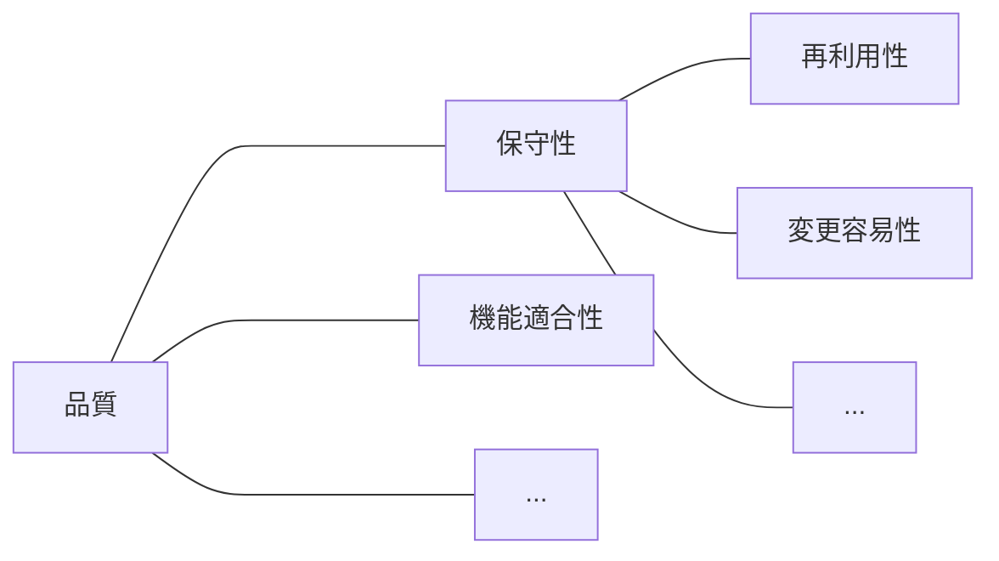

<section-title title="品質の高いコードとは？" />

参考: [JIS X 25010:2013](https://kikakurui.com/x2/X25010-2013-01.html)

Construct ID を例に挙げると...

- 命名規則を PascalCase で統一する
- Construct ID には変数を無闇に使用しない
- ...etc

<!--
では本題に入っていくのですが、そもそも 品質の高いコードとは何でしょうか？

実はソフトウェア品質については規格が定められており、このようにいくつかの特性に分類されています。

[click] CDK においては、このような品質を高めるためのセオリーやベストプラクティスがいくつかあり、Construct ID を例に挙げると、命名規則を PascalCase で統一しましょう。というものだったり、Construct ID には変数を無闇に使用しないようにしましょう。などがあります。

先月の AWS Summit の後藤さんのセッションでも、このような内容を含んだものがありましたし、今年の3月に開催された JAWS UG Tokyo の IaC Night でも、ソフトウェア品質の保守性の特性にフォーカスした内容で、私もセッションをしました

[click] 他にも、いろいろな記事やセッションで扱われています
-->
